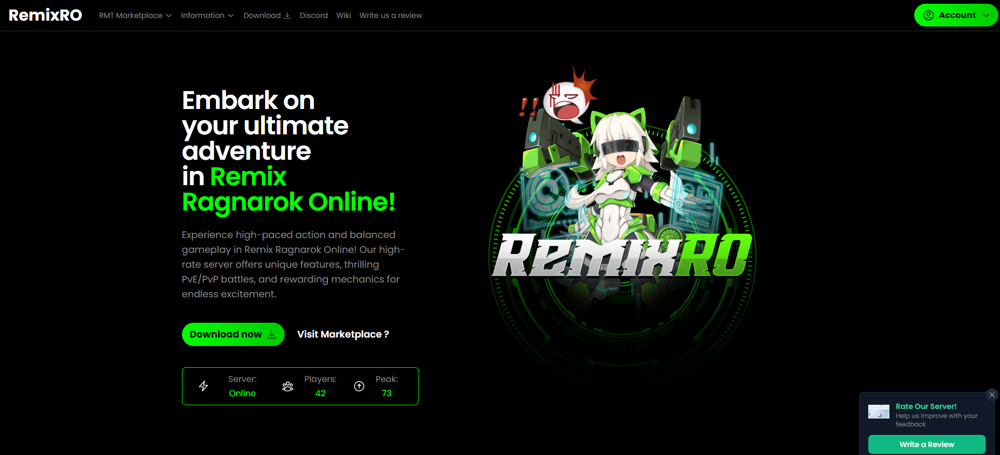

FluxCP
======

Flux Control Panel (FluxCP) for rAthena servers.

# 🎁 Donation Platform - TailwindCSS Edition

A modern, lightweight control-panel built using **Tailwind CSS**. This version includes additional features such as integrated **donation processing** and **Discord Webhook** support for real-time notifications.

---

## 🚀 Features

- 🔹 **Tailwind CSS**: Fully responsive and fast frontend styling
- 💳 **Donation Integration**: Easily connect with providers like Stripe, PayPal, or custom gateways
- 📡 **Discord Webhook**: Sends donation notifications directly to your Discord server
- 🌙 **Dark Mode Support** (optional toggle)
- 📱 Mobile-friendly UI
